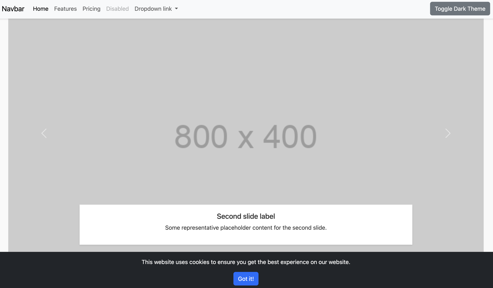

# HTML5 Boilerplate

This is a simple HTML5 boilerplate designed to kickstart your web development projects. It includes a basic structure with a navigation bar, form, carousel, and footer, and comes with pre-configured meta tags for SEO and social media integration.

<details>
<summary>Table of Contents</summary>

- [Features](#features)
- [Preview](#preview)
- [Usage](#usage)
- [Customization](#customization)
- [Suggested Images](#suggested-images)
- [Contributing](#contributing)
- [License](#license)

</details>

## Features

- Responsive design using Bootstrap 5
- SEO and social media meta tags
- Dark and light theme toggle
- Cookie notice
- Announcement bar
- Basic form with validation
- Accordion and carousel components

## Preview

Check out the live preview [here](https://iabn0rma1.github.io/HTML5-boilerplate/).
[](https://iabn0rma1.github.io/HTML5-boilerplate/)

## Usage

### Getting Started

1. Clone the repository:
    ```sh
    git clone https://github.com/iABn0rma1/HTML-boilerplate.git
    ```
2. Navigate to the project directory:
    ```sh
    cd HTML-boilerplate
    ```
3. Open `index.html` in your browser to view the template.

### Directory Structure

```
HTML-boilerplate/
├── assets/
│   ├── favicon_io/
│   ├── images/
│   └── preview-eg.webp
├── css/
│   └── style.css
├── js/
│   └── script.js
├── index.html
└── README.md
```

### Meta Tags

This boilerplate includes SEO and social media meta tags in the `<head>` section. Customize the content attributes to match your project's details:

```html
<meta name="description" content="A brief description of the page.">
<meta name="keywords" content="HTML boilerplate, HTML template, web development, front-end, starter code, SEO">
<meta name="author" content="Aman Barthwal">
<meta property="og:title" content="Boilerplate">
<meta property="og:description" content="A brief description of the page.">
<meta property="og:image" content="https://github.com/iABn0rma1/HTML-boilerplate/blob/main/assets/preview-eg.webp">
<meta property="og:url" content="https://i-abnormal.netlify.app">
<meta property="og:type" content="website">
<meta name="twitter:card" content="Boilerplate">
<meta name="twitter:site" content="@amanbarthwal0110">
<meta name="twitter:creator" content="@amanbarthwal0110">
<meta name="twitter:title" content="Boilerplate">
<meta name="twitter:description" content="A brief description of the page.">
<meta name="twitter:image" content="https://github.com/iABn0rma1/HTML-boilerplate/blob/main/assets/preview-eg.webp">
```

## Customization

### CSS Variables

The template uses CSS variables for easy theming. You can find these variables in the `<style>` section of `index.html`:

```css
:root {
    --background-color: #f9f9f9;
    --text-color: #333;
    --header-footer-bg: #ffffff;
    --nav-bg: #ffffff;
    --element-bg: #ffffff;
    --carousel-bg: rgba(255, 255, 255, 0.7);
    --shadow-color: rgba(0, 0, 0, 0.1);
    --link-color: #007bff;
    --link-hover-color: #0056b3;
    --input-bg: #ffffff;
    --input-border: #ced4da;
}
```

For dark mode, the following variables are used:

```css
[data-theme="dark"] {
    --background-color: #333;
    --text-color: #f9f9f9;
    --header-footer-bg: #444;
    --nav-bg: #444;
    --element-bg: #555;
    --carousel-bg: rgba(0, 0, 0, 0.7);
    --shadow-color: rgba(255, 255, 255, 0.1);
    --link-color: #66b2ff;
    --link-hover-color: #3399ff;
    --input-bg: #666;
    --input-border: #888;
}
```

### JavaScript

The template includes a basic script to handle theme toggling, cookie notice, and navbar behavior. Customize `script.js` to add more functionality as needed.

## Suggested Images

To enhance the visual appeal of your project, consider using the following types of images:

- **Hero Image**: A high-quality, relevant image for the hero section of your page.
- **Icons**: Use consistent icons for navigation and action buttons.
- **Illustrations**: Add custom illustrations to highlight key features or sections.
- **Backgrounds**: Subtle, repeating patterns or gradient backgrounds to add depth.

Choose the Right File Format:

- **JPEG**: Best for photographs and images with complex color gradients.

- **PNG**: Best for images with transparency or simpler graphics (logos, line art).

- **WebP**: A modern format supported by most browsers that often offers superior compression compared to JPEG and PNG.

- **SVG**: Ideal for scalable graphics (icons, logos). SVGs are text-based and can be resized without losing quality.

You can find free, high-quality images on sites like [Unsplash](https://unsplash.com), [Pexels](https://www.pexels.com), and [Freepik](https://www.freepik.com).

## Contributing

Contributions are welcome! Please open an issue or submit a pull request with any improvements or bug fixes.

## License

This project is licensed under the MIT License. See the [LICENSE](LICENSE) file for more information.

---

Enjoy using the HTML5 Boilerplate! If you have any questions or need further assistance, feel free to contact [me](https://www.linkedin.com/in/aman-barthwal-iabn0rma1/).